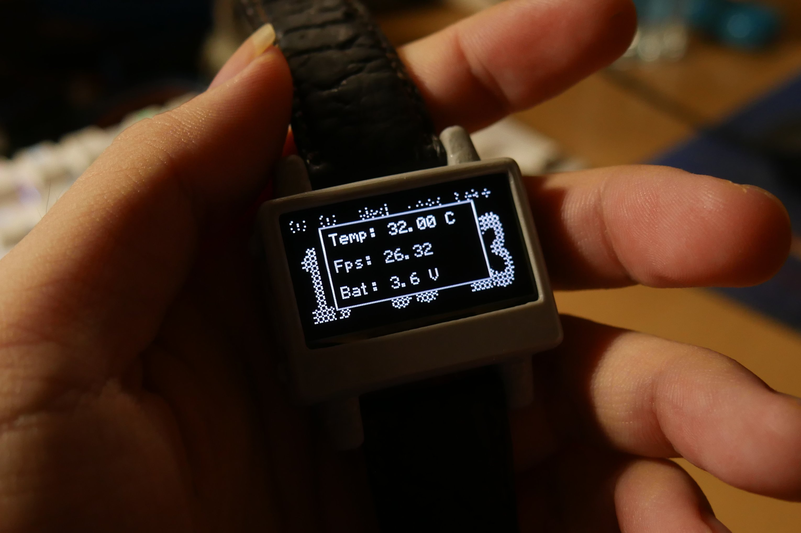
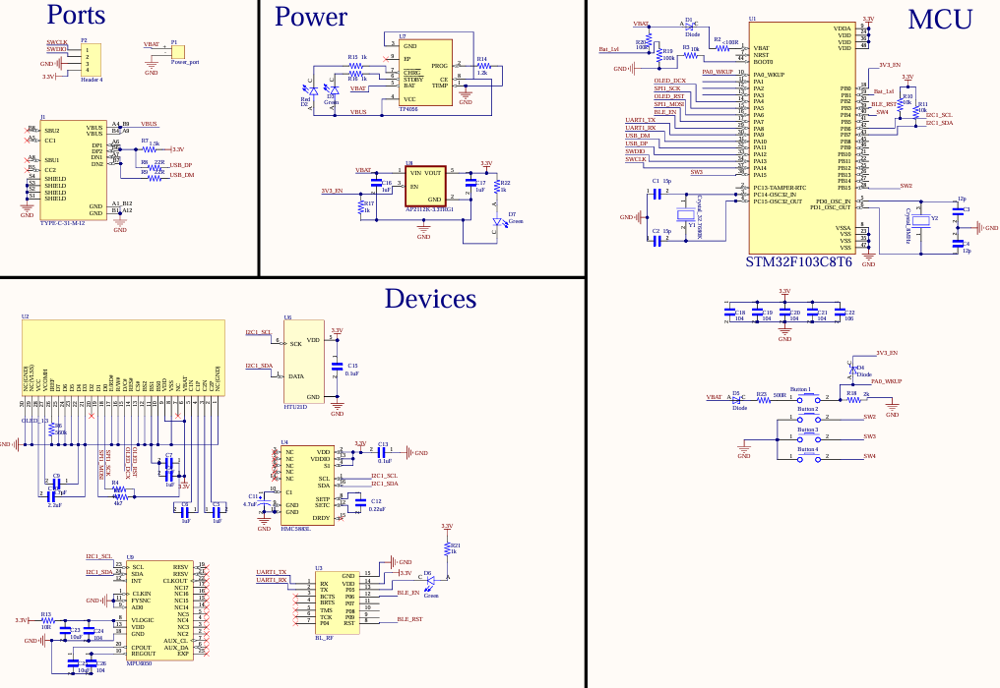
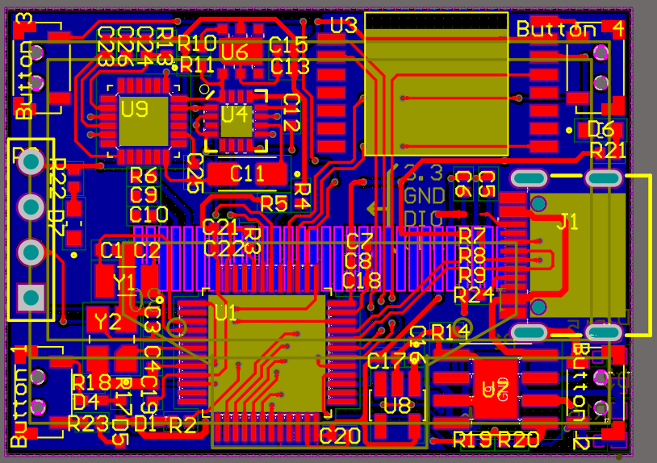
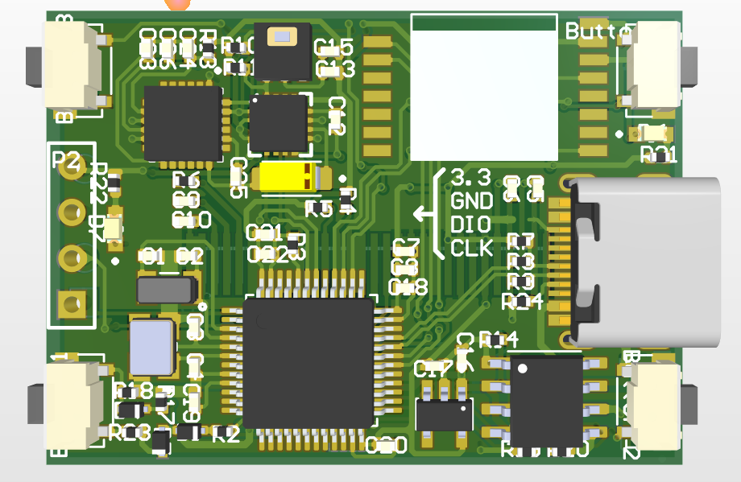
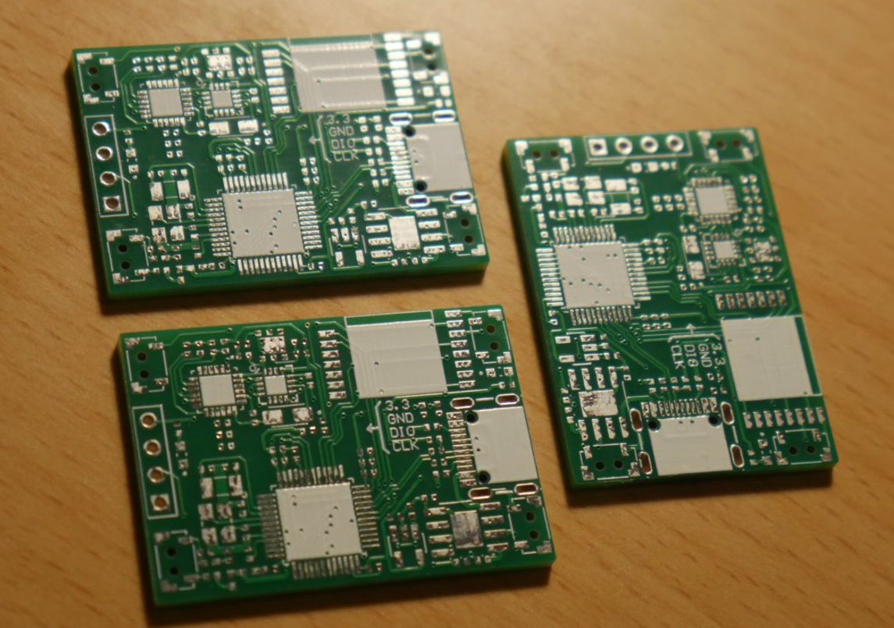
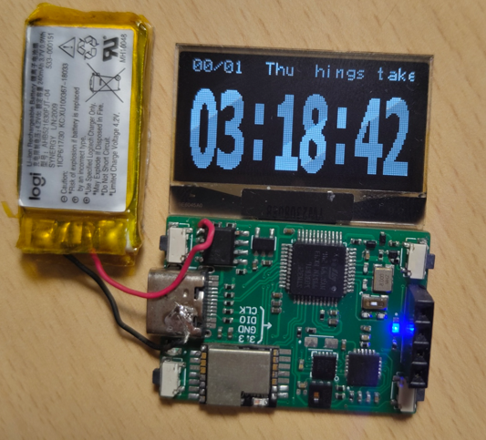
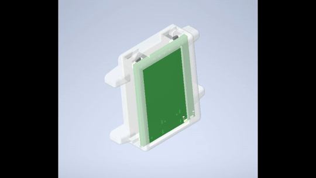
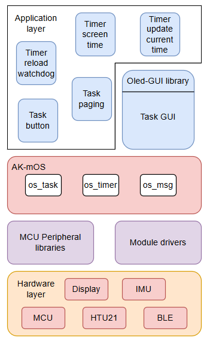

# Leta
```The name:``` Leta is summer in russia. It is the time that i started to make my own wrist watch.

<figure>
  
  <figcaption align=center>Oled wrist watch using Stm32f1 with mini RTOS and Monochrome GUI</figcaption>
</figure>


# Demo
<div align="center">
    <video src="https://github.com/user-attachments/assets/c9f8b56e-a367-4709-93c1-a5930ff01f5d" alt="Leta demo" />
</div>

# Schematic

<figure>
  
</figure>

+ Microcontroller: Stm32f103xx, 128 kB ROM, 20 kB RAM. Build-int RTC.
+ IMU: MPU6050, HCM5883L.
+ Temp and humid: HTU21D.
+ Bluetooth: RF-BM-4044B4(RF-Star).
+ Display: SH1106 oled 1.3" 128x64.
+ Power: TP4056 charger IC, regulator 3.3V AP2112.

# PCB
<figure>
  
</figure>

+ 2 layers
+ USB interface
+ 1 port SWD interface
+ 4 buttons

<figure>
  
</figure>

<figure>
  
</figure>

<figure>
  
</figure>

# Enclosure

<figure>
  
</figure>

# Program layers

<figure>
  
</figure>

## AK-mOS
This project uses a mini RTOS (AK-mOS) which written by me for AK-base-kit (ARM cortex M3). 
The kit you can check out here:

The mini RTOS has following features:
+ Preemptive scheduling
+ Round-robin scheduling
+ Inner tasks communiation
+ Software timer


More detail about it: 


This mini RTOS was created for learning purpose with context switch based on freeRTOS.

Im wishing this OS can be used more to test stability.

## Oled GUI
To control oled display with rich animating. I wrote the library to increase experience on UI.

The UI has some widget like:
+ Switch
+ Label text
+ Check box
+ Bitmap
+ Indicator
+ Pop-up notify
+ Slider

Animating can do these things to widgets:
+ Fading
+ Moving
+ Resizing

Check out here is more detail about my GUI:

# References
These links below are materials which helped me a lot when bulding my project:

+ https://github.com/ZeekiChen/iWatch-v2.0
+ https://github.com/lvgl/lvgl
+ https://github.com/Sheep118/WouoUI-PageVersion
+ https://github.com/epcbtech/ak-base-kit-stm32l151
+ https://github.com/FreeRTOS/FreeRTOS-Kernel
